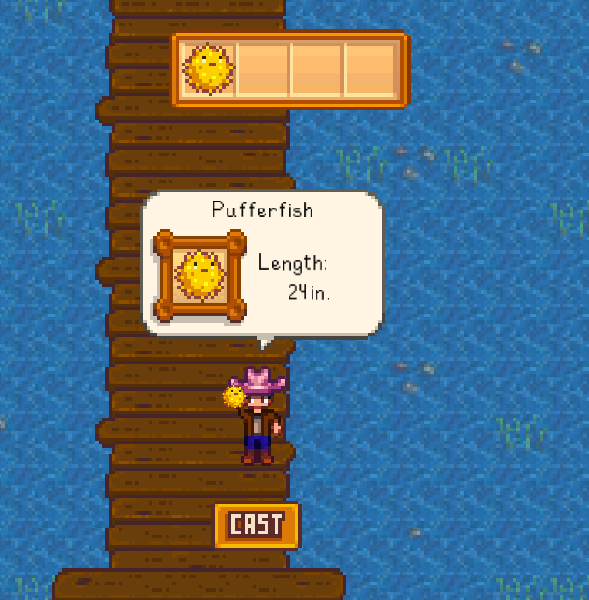

# Stardew Fishing

Welcome to the Stardew Fishing project! This repo contains code and assets that recreate the fishing mechanic from Stardew Valley. 

## Preview

Here’s a quick peek at some of the assets:

| Asset                                           | Preview                                                         | Description                                    |
|-------------------------------------------------|-----------------------------------------------------------------|------------------------------------------------|
| [dock_waves-aHe7c75C.webp](public/assets/dock_waves-aHe7c75C.webp)         |              | Animated wave background for dock scenes       |
| [dock_seafloor-ClSJk1QZ.png](public/assets/dock_seafloor-ClSJk1QZ.png)       |          | Seafloor or dock bottom imagery                |
| [caught_fish_dialog-D1cnXbxS.png](public/assets/caught_fish_dialog-D1cnXbxS.png) |  | Popup/dialog background for catches             |
| [red_cross-BUDfBMZv.png](public/assets/red_cross-BUDfBMZv.png)             |              | Example “X” or “error” indicator icon           |
| [crab-B1CECoEJ.png](public/assets/crab-B1CECoEJ.png)                   |                      | “Crab” fish type icon                           |
| [pufferfish-DWzNzGoA.png](public/assets/pufferfish-DWzNzGoA.png)           |            | “Pufferfish” fish type icon                     |
| [tuna-lfHzIE2D.png](public/assets/tuna-lfHzIE2D.png)                     |                        | “Tuna” fish type icon                           |
| [SmallFont-gJKNelK7.png](public/assets/SmallFont-gJKNelK7.png)             |                  | Pixel-style font sheet used to render letters   |

## Table of Contents

- [Stardew Fishing](#stardew-fishing)
  - [Preview](#preview)
  - [Table of Contents](#table-of-contents)
  - [Project Structure](#project-structure)
  - [Installation](#installation)
  - [Usage](#usage)
  - [Game](#game)

## Project Structure

- public/assets/: Contains images, including fish icons, backgrounds, and UI elements.
- src/: Contains game logic and other backend code.
- public/assets/index-CX-E9Xst.js: Main JavaScript tied to the frontend interface.

## Installation

Clone the repository:

```bash
git clone <repository-url>
cd stardew-valley-fishing
npm install
```

## Usage

Start the development server:

```bash
node app.js
```

Navigate to http://localhost:8081 in your browser. You should see:

- A main screen with an animated wave background.
- The Stardew fishing UI with interactive elements.

## Game

<table>
  <tr>
    <td></td>
    <td></td>
  </tr>
  <tr>
    <td></td>
    <td></td>
  </tr>
</table>
